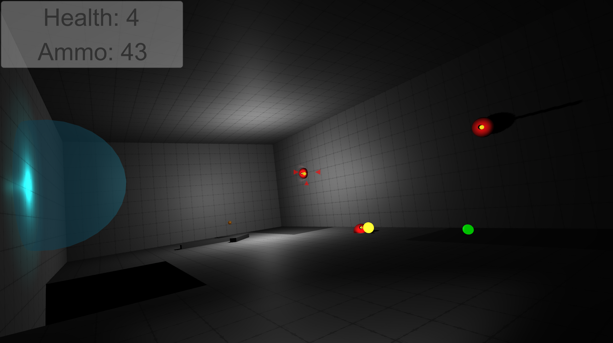

# Six DoF Game
Multiplatform game made in Unity with six degrees of freedom controls.

The games levels consist of two parts: the actual level, and the base game scene. When loading from the main menu, both are automaticaly loaded, but the same is not so when in the editor. It is therefore nessesary to have the base scene loaded in addition to the level when testing.

For testing the mobile controls in the editor, the mobile controller script on the object named "Mobile Controller" in the base scene can be used to force mobile controls by toggling "On Mobile".

## Building
The project is built using 2019.3.6f, and uses Unitys ProBuilder package, making it nessesary when building the game. Besides this, no other packages or assets are used, and platform is automaticaly adjusted for, so no other changes are nessesary for building on other platforms.
